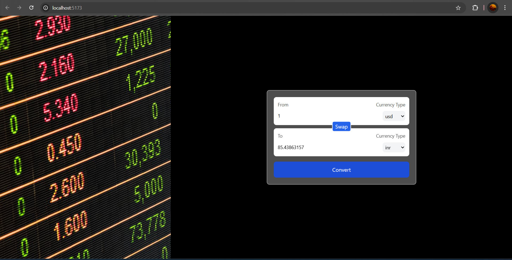

# 💱 Simple Currency Converter

A sleek, minimal React-based currency converter app that allows users to quickly convert between global currencies. Built with modern React hooks and a clean UI, this tool makes currency conversion fast, intuitive, and responsive.

---


## 🚀 Features

- 🔄 Real-time currency exchange rates
- 🌐 Support for multiple currencies using a free and up-to-date public API
- 💡 Intuitive swapping between "From" and "To" currencies
- 🎯 Built with React functional components and custom hooks
- 📱 Responsive and mobile-friendly design with Tailwind CSS

---


## 🖼️ Preview



---

## 🛠️ Tech Stack

- **React** (with Hooks)
- **Tailwind CSS**
- **FawazAhmed Currency API**  
  `https://github.com/fawazahmed0/currency-api`

---

## 📂 Folder Structure
├── App.jsx # Main app logic and UI layout
├── components/
│ └── Input.jsx # Reusable input component for currency & amount
├── hooks/
│ └── useConverter.js # Custom hook to fetch exchange rates

---

## 🧠 How It Works

- `useConverter(currency)` — A custom hook that fetches the latest rates for the selected base currency.
- `Input` — Handles both amount input and currency selection with full control via props.
- `App` — Ties everything together with state management for input, output, conversion logic, and swap functionality.

---

## 🌍 API Reference

- Exchange rates are fetched live from:  
  `https://cdn.jsdelivr.net/npm/@fawazahmed0/currency-api@latest/v1/currencies/{currency}.json`

---

## 🧪 Getting Started

Clone the repo and install dependencies:

```bash
git clone https://github.com/your-username/simple-currency-converter.git
cd simple-currency-converter
npm install
npm run dev  # or npm start
